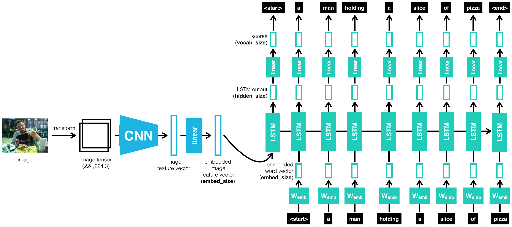
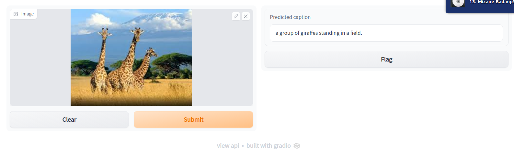

# Automatic Image Captioning using PyTorch on COCO Dataset

## Project Overview

In this project, I'll create a neural network architecture consisting of both CNNs (Encoder) and LSTMs (Decoder) to automatically generate captions from images.
The network will be trained on the Microsoft Common Objects in COntext [(MS COCO)](http://cocodataset.org/#home) dataset. The image captioning model is displayed below.

 [Image source](https://arxiv.org/pdf/1411.4555.pdf)

After training the network, I will test the network on novel images!

## Preparing the environment
**Note**: I have developed this project on __Linux__. It can surely be run on Windows and Mac with some little changes.

1. Clone the repository, and navigate to the downloaded folder.
```
git clone https://github.com/iamirmasoud/image_captioning.git
cd image_captioning
```

2. Create (and activate) a new environment, named `captioning_env` with Python 3.7. If prompted to proceed with the install `(Proceed [y]/n)` type y.

	```shell
	conda create -n captioning_env python=3.7
	source activate captioning_env
	```
	
	At this point your command line should look something like: `(captioning_env) <User>:image_captioning <user>$`. The `(captioning_env)` indicates that your environment has been activated, and you can proceed with further package installations.

6. Before you can experiment with the code, you'll have to make sure that you have all the libraries and dependencies required to support this project. You will mainly need Python3.7+, PyTorch and its torchvision, OpenCV, and Matplotlib. You can install  dependencies using:
```
pip install -r requirements.txt
```

7. Navigate back to the repo. (Also, your source environment should still be activated at this point.)
```shell
cd image_captioning
```

8. Open the directory of notebooks, using the below command. You'll see all of the project files appear in your local environment; open the first notebook and follow the instructions.
```shell
jupyter notebook
```

9. Once you open any of the project notebooks, make sure you are in the correct `captioning_env` environment by clicking `Kernel > Change Kernel > captioning_env`.


## Dataset
### About MS COCO dataset
The Microsoft **C**ommon **O**bjects in **CO**ntext (MS COCO) dataset is a large-scale dataset for scene understanding.  The dataset is commonly used to train and benchmark object detection, segmentation, and captioning algorithms.  


You can read more about the dataset on the [website](http://cocodataset.org/#home), [research paper](https://arxiv.org/pdf/1405.0312.pdf), or Appendix section at the end of this page.

### Install COCO API

1. Clone this repo: https://github.com/cocodataset/cocoapi  
```
git clone https://github.com/cocodataset/cocoapi.git  
```

2. Setup the coco API (also described in the readme [here](https://github.com/cocodataset/cocoapi)) 
```
cd cocoapi/PythonAPI  
make  
cd ..
```

3. Download some specific data from here: http://cocodataset.org/#download (described below)

* Under **Annotations**, download:
  * **2014 Train/Val annotations [241MB]** (extract captions_train2014.json and captions_val2014.json, and place at locations cocoapi/annotations/captions_train2014.json and cocoapi/annotations/captions_val2014.json, respectively)  
  * **2014 Testing Image info [1MB]** (extract image_info_test2014.json and place at location cocoapi/annotations/image_info_test2014.json)

* Under **Images**, download:
  * **2014 Train images [83K/13GB]** (extract the train2014 folder and place at location cocoapi/images/train2014/)
  * **2014 Val images [41K/6GB]** (extract the val2014 folder and place at location cocoapi/images/val2014/)
  * **2014 Test images [41K/6GB]** (extract the test2014 folder and place at location cocoapi/images/test2014/)

## Jupyter Notebooks
The project is structured as a series of Jupyter notebooks that should be run in sequential order:

### [0. Dataset Exploration notebook](0_Dataset_Exploration.ipynb) 

This notebook initializes the [COCO API](https://github.com/cocodataset/cocoapi) (the "pycocotools" library) used to access data from the MS COCO (Common Objects in Context) dataset, which is "commonly used to train and benchmark object detection, segmentation, and captioning algorithms."

### [1. Architecture notebook](1_Architecture.ipynb) 

This notebook uses the pycocotools, torchvision transforms, and NLTK to preprocess the images and the captions for network training. It also explores details of EncoderCNN, which is taken pretrained from [torchvision.models, the ResNet50 architecture](https://pytorch.org/docs/master/torchvision/models.html#id3). The implementations of the EncoderCNN and DecoderRNN are found in the [model.py](model.py) file.

The core architecture used to achieve this task follows an encoder-decoder architecture, where the encoder is a pretrained ResNet CNN on ImageNet, and the decoder is a basic one-layer LSTM.

#### Architecture Details


The left half of the diagram depicts the "EncoderCNN", which encodes the critical information contained in a regular picture file into a "feature vector" of a specific size. That feature vector is fed into the "DecoderRNN" on the right half of the diagram (which is "unfolded" in time - each box labeled "LSTM" represents the same cell at a different time step). Each word appearing as output at the top is fed back to the network as input (at the bottom) in a subsequent time step until the entire caption is generated. The arrow pointing right that connects the LSTM boxes together represents hidden state information, which represents the network's "memory", also fed back to the LSTM at each time step.

The architecture consists of a CNN encoder and RNN decoder. The CNN encoder is a pre-trained ResNet on ImageNet, which is a VGG convolutional neural network with skip connections. It has been proven to work really well on tasks like image recognition because the residual connections help model the residual differences before and after the convolution with the help of the identity block. A good pre-trained network on ImageNet is already good at extracting both useful low-level and high-level features for image tasks, so it naturally serves as a feature encoder for the image we want to caption. Since we are not doing the traditional image classification task, we drop the last fully connected layer and replace it without a new trainable fully connected layer to help transform the final feature map to an encoding that is more useful for the RNN decoder.

RNNs have long been shown useful in language tasks due to their ability to model data with sequential nature, such as language. Specifically, LSTMs even incorporate both long-term and short-term information as memories in the network. Thus, we pick an RNN decoder for the captioning task. Specifically, following the spirit of sequence to sequence (seq2seq) models used in translation, I leveraged the architecture choices in [this paper](https://arxiv.org/pdf/1411.4555.pdf) to use an LSTM to generate captions based on the encoded information from the CNN encoder. Specifically, **I first use the CNN encoder output concatenated with the "START" token as the initial input for the RNN decoder.** I apply a fully connected layer on the hidden states at that timestamp to output a softmax probability over the words in our entire vocabulary, where we choose the word with the highest probability as the word generated at that timestamp. Then, we feed this predicted word back again as the input for the next step. We continue so until we generated a caption of max length, or the network generated the "STOP" token, which indicates the end of the sentence.

#### LSTM Decoder
In the project, we pass all our inputs as a sequence to an LSTM. A sequence looks like this: first a feature vector that is extracted from an input image, then a start word, then the next word, the next word, and so on.

#### Embedding Dimension
The LSTM is defined such that, as it sequentially looks at inputs, it expects that each individual input in a sequence is of a consistent size and so we embed the feature vector and each word so that they are `embed_size`.

#### Using my trained model
You can [download](https://drive.google.com/file/d/1s3aRAdt8ZMqn53UUSSFLCDBJ_F-KNbpE/view?usp=sharing) my trained models by unzipping the `captioning_models.zip` file in the `models` directory of project for your own experimentation.

Feel free to experiment with alternative architectures, such as bidirectional LSTM with attention mechanisms!

### [2. Training notebook](2_Training.ipynb) 

This notebook provides the selection of hyperparameter values and EncoderRNN training. The hyperparameter selection is also explained.


#### Parameters

- `batch_size` - the batch size of each training batch. It is the number of image-caption pairs used to amend the model weights in each training step. 
- `vocab_threshold` - the minimum word count threshold. Note that a larger threshold will result in a smaller vocabulary, whereas a smaller threshold will include rarer words and result in a larger vocabulary. 
- `vocab_from_file` - a Boolean that decides whether to load the vocabulary from file. 
- `embed_size` - the dimensionality of the image and word embeddings.
- `hidden_size` - the number of features in the hidden state of the RNN decoder.
- `num_epochs` - the number of epochs to train the model. We set `num_epochs=3`, but feel free to increase or decrease this number. [This paper](https://arxiv.org/pdf/1502.03044.pdf) trained a captioning model on a single state-of-the-art GPU for 3 days, but we'll soon see that we can get reasonable results in a matter of a few hours! (_But of course, if we want to compete with current research, we will have to train for much longer._)
- `save_every` - determines how often to save the model weights. We set `save_every=1`, to save the model weights after each epoch. This way, after the `i`th epoch, the encoder and decoder weights will be saved in the `models/` folder as `encoder-i.pkl` and `decoder-i.pkl`, respectively.
- `print_every` - determines how often to print the batch loss to the Jupyter notebook while training. Note that we probably **will not** observe a monotonic decrease in the loss function while training - this is perfectly fine and completely expected! We keep this at its default value of `20` to avoid clogging the notebook.
- `log_file` - the name of the text file containing, for every step, how the loss and perplexity evolved during training.


#### Image Transformations

In the original [ResNet](https://arxiv.org/pdf/1512.03385.pdf) paper, which is the ResNet architecture that our CNN encoder uses, it scales the shorter edge of images to 256, randomly crops it at 224, randomly samples, and horizontally flips the images, and performs batch normalization. Thus, to keep the best performance of the original ResNet model, it makes the most sense to keep the image preprocessing and transforms the same as the original model. Thus, I use the default `transform_train` as follows:

```
transform_train = transforms.Compose([ 
    transforms.Resize(256),                          # smaller edge of image resized to 256
    transforms.RandomCrop(224),                      # get 224x224 crop from random location
    transforms.RandomHorizontalFlip(),               # horizontally flip image with probability=0.5
    transforms.ToTensor(),                           # convert the PIL Image to a tensor
    transforms.Normalize((0.485, 0.456, 0.406),      # normalize image for pre-trained model
                         (0.229, 0.224, 0.225))])
```
If you are gonna modifying this transform, keep in mind that:
- The images in the dataset have varying heights and widths, and 
- When using a pre-trained model, it must perform the corresponding appropriate normalization.


#### Hyperparameters

To obtain a strong initial guess for which hyperparameters are likely to work best, I initially consulted [this paper](https://arxiv.org/pdf/1502.03044.pdf) and [this paper](https://arxiv.org/pdf/1411.4555.pdf). I used a minimum word count threshold of **5**, an embedding size of **512**, and a hidden size of **512** as well. I trained the network for 3 epochs. When initially inspecting the loss decrease, it is decreasing well as expected, but after training for 20 hours, when I did the inference on test images, the network appears to have overfitted on the training data, because generated captions are not related to the test images at all. I repeated the inference with the model trained after every epoch, and it still performs unsatisfactorily. Thus, I decreased the embedding size to **256** and trained again, this time for only 1 epoch. The network performs great this time! If you are unhappy with the performance, you can return to this notebook to tweak the hyperparameters (and/or the architecture in **model.py**) and re-train the model.


#### Trainable Parameters

We can specify a Python list containing the learnable parameters of the model. For instance, if we decide to make all weights in the decoder trainable, but only want to train the weights in the embedding layer of the encoder, then we should set `params` to something like:

```
params = list(decoder.parameters()) + list(encoder.embed.parameters()) 
```

I decided to freeze all but the last layer of ResNet, because it's already pre-trained on ResNet and performs well. We can still fine tune the entire ResNet for better performance, but since ResNet is a kind of big and deep architecture with a lot of parameters, freezing them makes the training faster, as the RNN decoder is already slow to train. Empirical results suggest that the pre-trained ResNet indeed does a good job. Since the last layer of the CNN encoder is used to transform the CNN feature map to something that RNN needs, it makes sense to train the last new fully connected layer from scratch. 

The RNN decoder is completely new, and not a part of the pre-trained ResNet, so we also train all the parameters inside the RNN decoder.

#### Optimizer

We need to select an [optimizer](http://pytorch.org/docs/master/optim.html#torch.optim.Optimizer). I chose the Adam optimizer to optimize the [CrossEntropyLoss](https://medium.com/swlh/cross-entropy-loss-in-pytorch-c010faf97bab) because it is one of the most popular and effective optimizers. It combines the benefits of weight decay, momentum, and many other optimization tricks altogether.

### [3. Inference notebook](3_Inference.ipynb) 

This notebook contains the testing of the trained networks to generate captions for additional images. No rigorous validation or accuracy measurement was performed, only sample images were generated. 


## Results
Here are some predictions from the model.

### Some good results
<br/>
<br/>
<br/>
<br/>
<br/>
<br/>


### Some not so good results

<br/>
<br/>
<br/>
<br/>
<br/>
<br/>


## Deploy and share image captioning service using Gradio

[Gradio](http://pytorch.org/docs/master/optim.html#torch.optim.Optimizer) is a package that allows users to create simple web apps with just a few lines of code. It is essentially used for the same purpose as Streamlight and Flask but is much simpler to utilize. Many types of web interface tools can be selected including sketchpad, text boxes, file upload buttons, webcam, etc. Using these tools to receive various types of data as input, machine learning tasks such as classification and regression can easily be demoed.

You can deploy an interactive version of the image captioning service on your browser by running the following command. Please don't forget to set the `cocoapi_dir` and encoder/decoder model paths to the correct values.

```shell
python gradio_main.py
```

Access the service on local URL:  http://127.0.0.1:7860/




## Future work
Steps for additional improvement would be exploring the hyperparameter and other architectures and also training with more epochs.

## Appendix: More about COCO dataset API
COCO is a large image dataset designed for object detection, segmentation, person keypoints detection, stuff segmentation, and caption generation. This package provides Matlab, Python, and Lua APIs that assists in loading, parsing, and visualizing the annotations in COCO. Please visit http://cocodataset.org/ for more information on COCO, including the data, paper, and tutorials. The exact format of the annotations is also described on the COCO website. The Matlab and Python APIs are complete, the Lua API provides only basic functionality.

In addition to this API, please download both the COCO images and annotations in order to run the demos and use the API. Both are available on the project website.
- Please download, unzip, and place the images in: coco/images/
- Please download and place the annotations in: coco/annotations/

For substantially more details on the API please see [COCO Home Page](http://cocodataset.org/#home).

After downloading the images and annotations, run the Matlab, Python, or Lua demos for example usage.

To install:
- For Matlab, add coco/MatlabApi to the Matlab path (OSX/Linux binaries provided)
- For Python, run "make" under coco/PythonAPI
- For Lua, run “luarocks make LuaAPI/rocks/coco-scm-1.rockspec” under coco/


Note: This project is a part of [Udacity Computer Vision Nanodegree Program](https://www.udacity.com/course/computer-vision-nanodegree--nd891).